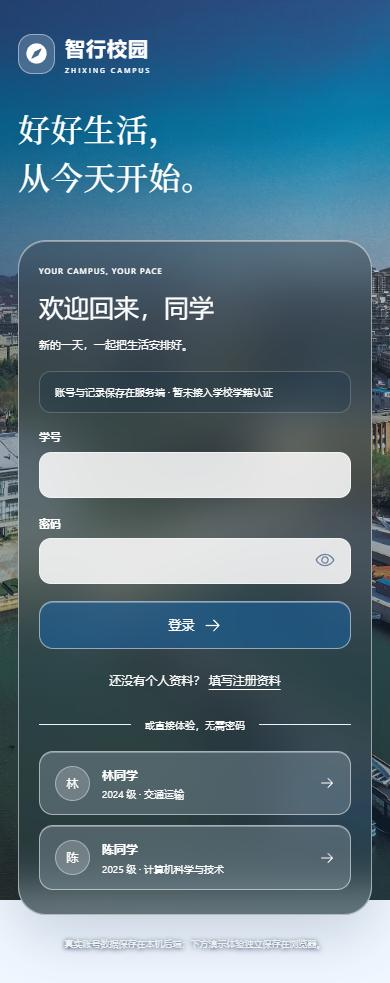
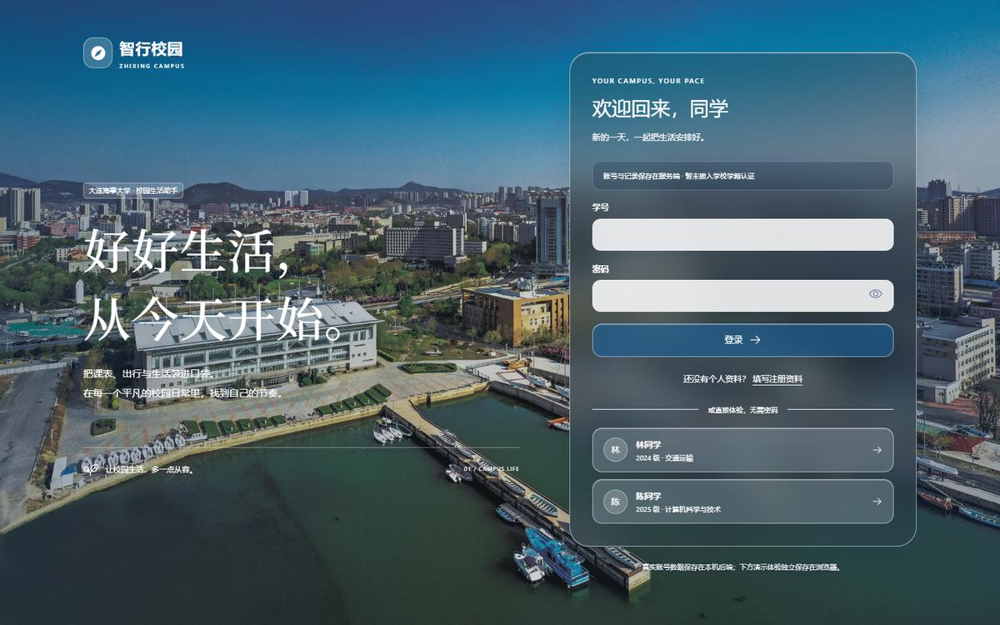
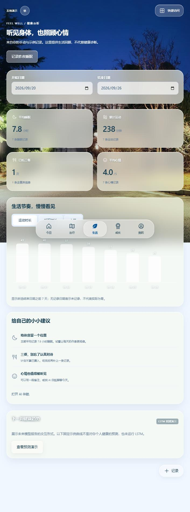
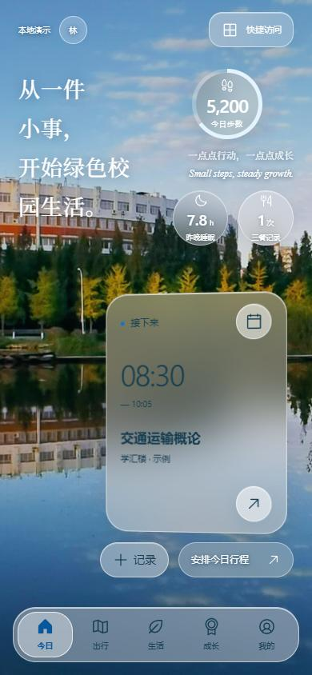
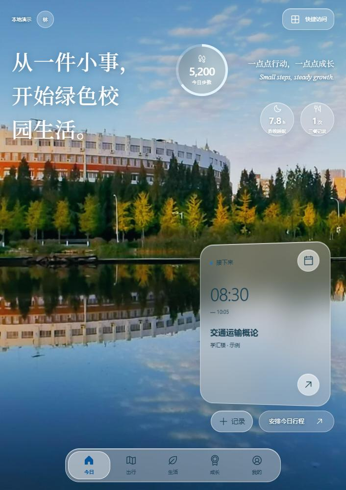
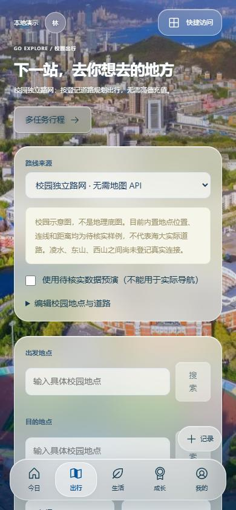
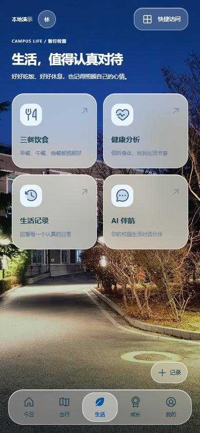
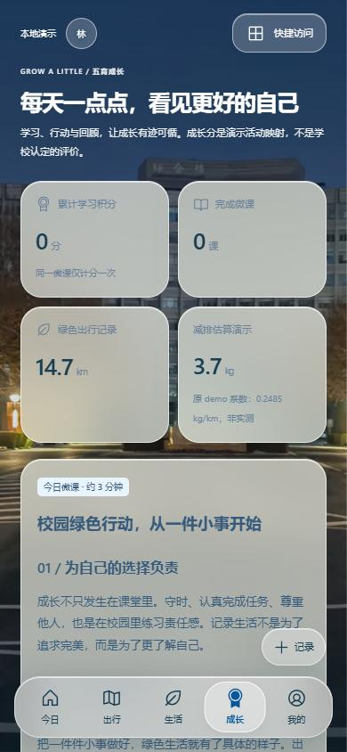
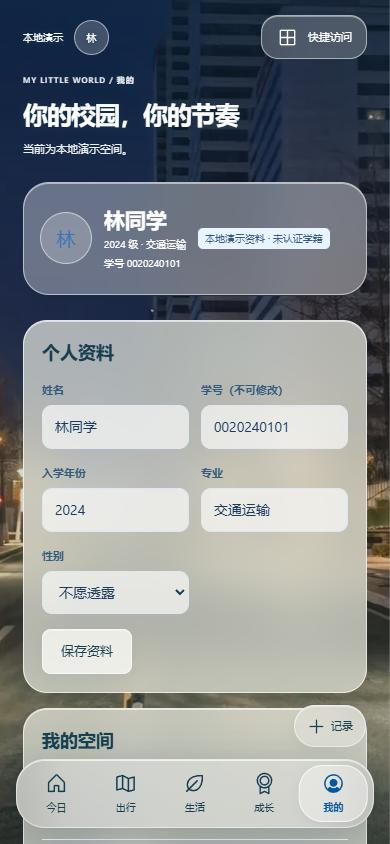

# 智行校园 · 前端视觉预览

2026-09-26 团队评审版。此分支不更新阿里云服务器。

本页可直接查看界面截图。需要操作交互时，下载或切换到 `preview/glass-ui-20260926` 分支，在 `frontend` 目录执行 `npm ci`、`npm run dev`，打开终端给出的地址，选择“林同学”或另一位演示用户进入。演示数据保存在各自浏览器，不共享真实账号或记录。真实注册登录需要另行启动 backend（见仓库 DEPLOY.md）。

本次包含手机优先布局、毛玻璃控件、五栏目独立海大实景背景、日历安排、快捷面板和编辑窗口删除记录。安排卡片背景为 70% 透明；删除前确认，失败保留原记录。

## 登录 · 手机

## 登录 · 桌面

## 健康分析

## 今日 · 手机

## 今日 · 较宽窗口

## 出行

## 生活

## 成长

## 我的

校景照片来源及尺寸见 [素材说明](../frontend/public/images/SOURCES.md)。照片用于当前设计评审，公开产品发布前需确认图片使用授权。截图仅包含内置演示数据。

验证：TypeScript 与生产构建通过；首页、空数据联动、五页导航、删除取消/失败/成功与刷新持久化的 4 项浏览器测试通过。

